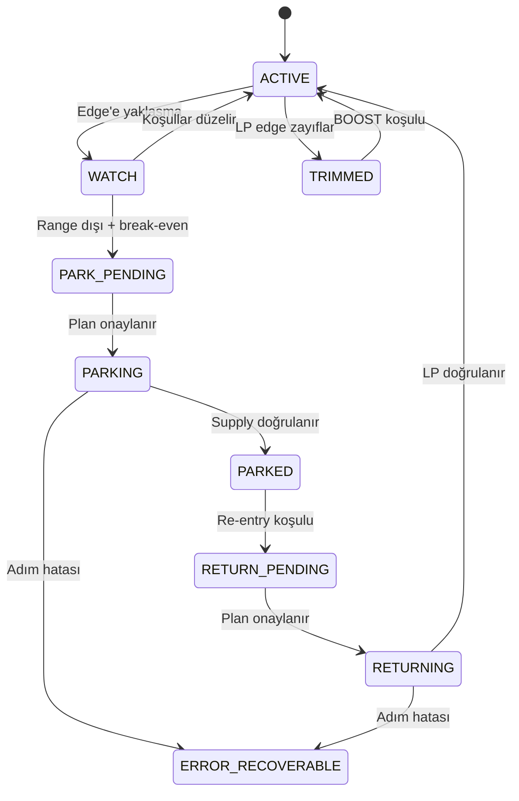
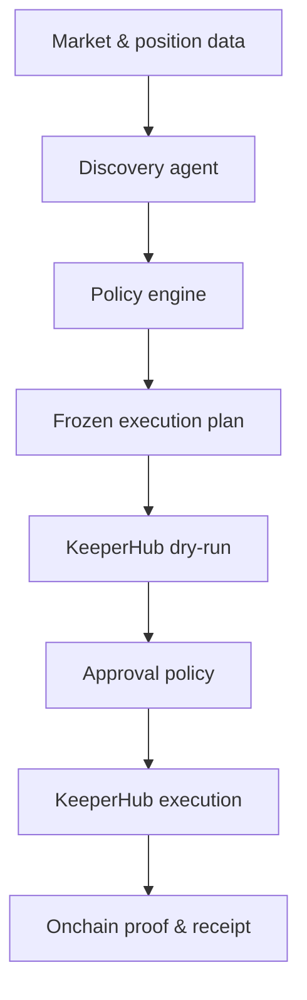
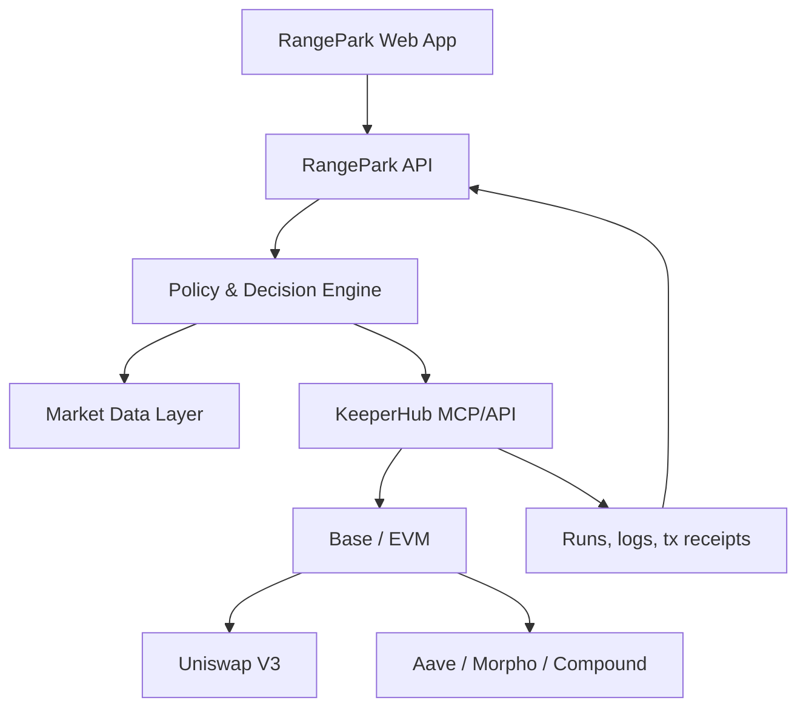

# RangePark

## Komple Ürün ve Teknik Mimari Dokümanı

**Sürüm:** 0.1 — Hackathon Product Blueprint  
**Tarih:** 27 Ağustos 2026  
**Hedef etkinlik:** KeeperHub — The Agent Economy Hackathon  
**Ana ağ odağı:** Base  
**İlk canlı entegrasyon:** Uniswap V3 + Aave V3 + Morpho + Compound V3  
**Ürün sahibi:** Semih Civelek  

---

## 1. Yönetici özeti

RangePark, concentrated-liquidity pozisyonlarında sermayenin her an en uygun işi yapmasını sağlayan deterministik bir sermaye verimliliği motorudur.

Uniswap V3 gibi protokollerde fiyat, LP pozisyonunun belirlenmiş tick aralığının dışına çıktığında likidite artık swap ücreti kazanmaz ve pozisyon tamamen tek varlığa dönüşür. Pozisyon zincir üzerinde durmaya devam eder ve fiyat tekrar aralığa girerse kendiliğinden yeniden aktif olabilir; fakat aralık dışında kaldığı süre boyunca sermaye **fee-idle** durumdadır.

RangePark bu sermayeyi:

1. Pozisyon gerçekten aralık dışında ve fee üretmiyorsa tespit eder.
2. Çıkış ve geri dönüşün ekonomik olarak mantıklı olup olmadığını hesaplar.
3. Likiditeyi güvenli şekilde azaltır ve biriken fee'leri toplar.
4. Ortaya çıkan varlığın türünü değiştirmeden Aave, Morpho veya Compound gibi izinli lending piyasaları arasında risk düzeltilmiş en iyi parking seçeneğini bulur.
5. KeeperHub üzerinden önceden simüle edilmiş, insan tarafından incelenebilir ve deterministik bir workflow ile fonu park eder.
6. Fiyat yeniden uygun bölgeye döndüğünde lending pozisyonunu kapatır, gerekli varlık oranını oluşturur ve LP pozisyonunu geri kurar.
7. LP getirisi çok güçlendiğinde pozisyonu kontrollü şekilde büyütebilir; getiri zayıfladığında veya fiyat range sınırına yaklaştığında pozisyonu kademeli küçültebilir.

Ürünün temel vaadi:

> **Every token has a job: earn fees in range, earn yield while waiting.**

Türkçe anlatımı:

> **Range içindeyken fee kazan, beklerken yield kazan.**

RangePark bir “en yüksek APR botu” veya sıradan bir LP rebalancer değildir. Ürün, kullanıcının belirlediği güvenlik politikaları içinde LP getirisi ile aynı varlığın lending getirisi arasında sermayeyi ölçekleyen, kararlarını açıklayan ve işlemleri KeeperHub ile güvenli şekilde yürüten bir **capital allocation engine**'dir.

---

## 2. Problem

### 2.1 Concentrated liquidity problemi

Uniswap V3'te likidite sağlayıcı, sermayesini sonsuz fiyat eğrisine dağıtmak yerine belirli bir fiyat aralığına yerleştirir. Bu yapı sermaye verimliliğini artırır; fakat fiyat seçilen aralığın dışına çıktığında pozisyon aktif likidite olmaktan çıkar ve fee kazanmayı bırakır.

Aralık dışındaki pozisyon:

- Swap ücreti kazanmaz.
- Fiyatın yönüne göre tamamen token0 veya token1'e dönüşür.
- Hâlâ fiyat riskine sahiptir.
- Fiyat tekrar aralığa girerse otomatik olarak aktif olabilir.
- Kullanıcı pozisyonu fark etmiyorsa uzun süre fee üretmeden bekleyebilir.

Bu nedenle “boş sermaye” ifadesi teknik olarak eksiktir. RangePark ürün dilinde **fee-idle capital** kullanılacaktır: sermaye varlık olarak durmakta fakat LP görevi açısından üretken değildir.

### 2.2 Kullanıcının bugünkü seçenekleri

Bir LP sahibi genellikle şu seçeneklerden birini kullanır:

- Pozisyonun geri dönmesini pasif şekilde beklemek.
- Pozisyonu manuel kapatmak.
- Varlığı başka bir yield protokolüne manuel taşımak.
- Yeni bir range belirleyerek yeniden LP olmak.
- Bir otomatik LP manager'a tüm kontrolü vermek.

Bu yaklaşımların eksikleri:

- Sürekli manuel takip gerekir.
- Gas, slippage ve fırsat maliyetleri çoğunlukla hesaplanmaz.
- En yüksek görünen APR'ı seçmek güvenli veya kârlı olmayabilir.
- Çıkış ve geri dönüş işlemleri birden fazla protokole yayılır.
- İşlem zincirinin bir adımı başarısız olduğunda fonun nerede kaldığı belirsiz olabilir.
- Otomasyon kararlarının nedeni çoğu zaman görünmezdir.
- Bir AI agent'a doğrudan fon kontrolü vermek, yorumlama ve prompt riskleri oluşturur.

### 2.3 RangePark'ın çözdüğü ana problem

RangePark şu soruyu cevaplar:

> “Bu varlığın, kullanıcının izin verdiği risk sınırları içinde, şu anda yapabileceği en verimli iş nedir?”

Olası cevaplar:

- Uniswap V3 içinde fee kazanmak.
- Pozisyonu değiştirmeden beklemek.
- LP miktarını kontrollü artırmak.
- LP miktarını kademeli azaltmak.
- Aynı varlığı Aave'de park etmek.
- Aynı varlığı Morpho'nun izinli bir marketinde park etmek.
- Aynı varlığı Compound V3'te park etmek.
- Veri veya güvenlik koşulları uygun değilse hiçbir işlem yapmamak.

---

## 3. Ürün vizyonu ve konumlandırma

### 3.1 Vizyon

Her concentrated-liquidity pozisyonunun, aktif olduğu zaman fee; aktif olmadığı zaman güvenli yield üretmesini sağlamak.

### 3.2 Misyon

LP sermayesinin durumunu sürekli izleyen, alternatif getiri kaynaklarını risk düzeltilmiş şekilde değerlendiren ve tüm değer hareketlerini KeeperHub üzerinden denetlenebilir workflow'larla gerçekleştiren açık bir sermaye yönetim katmanı oluşturmak.

### 3.3 Ürün kategorisi

RangePark aşağıdaki kategorilerin kesişimindedir:

- Concentrated liquidity automation
- Idle-capital management
- Risk-aware yield routing
- Deterministic agent execution
- DeFi workflow observability

### 3.4 RangePark ne değildir?

RangePark:

- Kullanıcının izni dışında protokol seçen kontrolsüz bir yield chaser değildir.
- Fonları farklı varlığa çevirerek yönsel pozisyon alan bir trading bot değildir.
- Borçlanma veya leverage kullanan bir recursive farming sistemi değildir.
- Yalnızca bildirim gönderen bir position monitor değildir.
- Yalnızca Uniswap aralığını sürekli yeniden merkezleyen klasik bir rebalancer değildir.
- Agent'ın işlem anında serbestçe karar değiştirdiği probabilistik bir executor değildir.
- En yüksek görünen APR'ı güvenlik kontrolleri olmadan takip etmez.

### 3.5 Temel farklılaştırıcı

Klasik LP manager'lar çoğunlukla “range'i nasıl yeniden ayarlarız?” sorusuna odaklanır. RangePark ise daha üst düzey bir soruya odaklanır:

> “Sermaye şu anda LP olarak mı, lending'de mi, yoksa beklemede mi daha doğru kullanılıyor?”

RangePark'ın farklılığı yalnızca LP'yi yeniden dengelemesi değil; sermayenin görevini **EARN, TRIM, PARK ve RETURN** durumları arasında kontrollü şekilde değiştirmesidir.

---

## 4. Hedef kullanıcılar

### 4.1 Bireysel LP

- Bir veya birkaç Uniswap V3 NFT pozisyonu tutar.
- Pozisyonu gün boyu takip etmek istemez.
- Range dışındayken aynı varlığı güvenli lending'de değerlendirmek ister.
- Kararların nedenini ve işlem kayıtlarını görmek ister.

### 4.2 DAO veya treasury

- Stablecoin veya WETH treasury'sini LP olarak kullanır.
- İzinli protokol listesi, maksimum allocation ve insan onayı ister.
- Her fon hareketi için denetlenebilir kayıt ister.
- Safe veya kurumsal wallet akışına ihtiyaç duyar.

### 4.3 Profesyonel liquidity manager

- Birden çok pozisyonu yönetir.
- Tek tek pozisyonlar yerine policy tabanlı otomasyon ister.
- Fee üretmeyen sermayeyi otomatik değerlendirmek ister.
- Range, fee ve lending getirilerini tek ekranda izlemek ister.

### 4.4 Protokol veya frontend entegratörü

- RangePark'ın workflow veya API/MCP arayüzünü kendi ürününe eklemek ister.
- Yeni DEX veya yield adapter'ı geliştirmek ister.
- Kendi kullanıcılarına “idle LP protection” sunmak ister.

---

## 5. Ana kullanıcı hikâyeleri

### 5.1 Pozisyonu korumaya alma

> Bir Uniswap V3 LP sahibi olarak, pozisyonum belirli süre range dışında kalırsa ve parking ekonomik olarak mantıklıysa likiditemin aynı varlık cinsinden güvenli lending'e yatırılmasını istiyorum.

### 5.2 Otomatik geri dönüş

> Bir LP sahibi olarak, fiyat güvenli geri giriş bölgesine döndüğünde park edilmiş sermayemin lending'den çekilerek yeniden LP pozisyonuna yerleştirilmesini istiyorum.

### 5.3 Akıllı küçültme

> Bir LP sahibi olarak, pozisyon range sınırına yaklaştığında veya beklenen net LP getirisi parking getirisinin altına düştüğünde pozisyonun tamamını tek seferde kapatmak yerine kademeli küçültülmesini istiyorum.

### 5.4 Akıllı büyütme

> Bir LP sahibi olarak, fiyat range'in güvenli bölgesindeyken ve LP'nin marjinal getirisi lending getirisinden anlamlı derecede yüksek olduğunda park edilmiş sermayenin bir kısmının LP'ye eklenmesini istiyorum.

### 5.5 Kararı denetleme

> Bir treasury yöneticisi olarak, her işlemden önce kullanılan veriyi, seçilen protokolü, reddedilen alternatifleri, tahmini maliyeti ve beklenen faydayı görmek istiyorum.

### 5.6 Hata sonrası fonu bulma

> Bir kullanıcı olarak, workflow'un herhangi bir adımı başarısız olduğunda fonun hangi protokol veya wallet'ta kaldığını ve güvenli sonraki adımın ne olduğunu görmek istiyorum.

---

## 6. Ürün kapsamı

### 6.1 Hackathon MVP kapsamı

İlk çalışan sürüm bilerek dar fakat derin olacaktır.

**Kaynak likidite protokolü**

- Uniswap V3
- Base
- WETH/USDC
- Tek bir NFT pozisyonuyla başlayıp çoklu pozisyon veri modelini destekleme

**Parking protokolleri**

- Aave V3
- Morpho
- Compound V3

**Zorunlu davranışlar**

- Pozisyonu ve current tick'i okuma
- In-range/out-of-range tespiti
- Minimum out-of-range süresi
- Aynı varlık için lending fırsatlarını karşılaştırma
- Risk ve capacity filtreleme
- Parking için break-even kontrolü
- KeeperHub dry-run
- Likidite azaltma
- Fee toplama
- Lending'e supply
- Park edilmiş pozisyonu izleme
- Lending'den withdraw
- Gerekli token oranını oluşturma
- Aynı veya belirlenmiş yeni range'e dönüş
- Transaction linkleri ve karar kaydı
- Retry, idempotency ve pause

**İsteğe bağlı fakat güçlü özellik**

- Bir adet gerçek `TRIM` veya `BOOST` işlemi
- Safe wallet entegrasyonu
- Discord/Telegram bildirimleri

### 6.2 Hackathon MVP dışında bırakılacaklar

- Cross-chain bridge
- Birden fazla zincirde eş zamanlı execution
- Leverage veya borrow
- Permissionless şekilde herhangi bir Morpho marketine deposit
- Herhangi bir tokeni USDC'ye çevirerek yield arama
- Dinamik, tamamen agent tarafından belirlenen yeni range optimizasyonu
- Her Uniswap V3 forkunda tam canlı destek
- Karmaşık impermanent-loss tahmin modeli
- MEV veya arbitrage stratejisi
- Kullanıcı adına custody sözleşmesi

### 6.3 Hackathon sonrası genişleme

- PancakeSwap V3 adapter'ı
- Aerodrome Slipstream adapter'ı
- Sushi V3 ve diğer NFPM benzeri deployment'lar
- Ethereum, Arbitrum ve Optimism
- Yearn V3, Spark ve izinli ERC-4626 vault'ları
- Çoklu LP portföyü
- Treasury policy marketplace
- Backtest ve policy simulator
- KeeperLint ile workflow security audit

---

## 7. Ana ürün modeli

### 7.1 Üç katmanlı model

RangePark üç farklı sorumluluğu ayırır:

1. **Discovery:** Piyasa ve pozisyon verisini toplar, alternatifleri araştırır.
2. **Policy & Planning:** Kullanıcı politikalarına göre izinli ve ekonomik bir execution planı oluşturur.
3. **Deterministic Execution:** İncelenmiş kesin planı KeeperHub üzerinden çalıştırır.

Agent'ın görevi keşif ve planlamaya yardımcı olmaktır. İşlem anında fon miktarı, hedef protokol, adres, slippage, deadline veya minimum output yeniden yorumlanmaz.

### 7.2 Temel durumlar

| Durum | Açıklama | Fonun bulunduğu yer |
|---|---|---|
| `ACTIVE` | Pozisyon range içinde ve fee kazanıyor | Concentrated-liquidity pozisyonu |
| `WATCH` | Pozisyon sınıra yakın veya geçici olarak range dışında | LP pozisyonu |
| `TRIMMED` | Likiditenin bir kısmı çıkarılmış | LP + lending/wallet |
| `PARK_PENDING` | Parking kararı oluşmuş, preflight veya onay bekliyor | LP pozisyonu |
| `PARKING` | Decrease/collect/supply workflow'u çalışıyor | Adımlara göre LP veya wallet |
| `PARKED` | Fee-idle sermaye lending'de yield kazanıyor | Aave/Morpho/Compound |
| `RETURN_PENDING` | Re-entry koşulları sağlanmış, plan/onay bekliyor | Lending pozisyonu |
| `RETURNING` | Withdraw/swap/mint workflow'u çalışıyor | Lending veya wallet |
| `PAUSED` | Kullanıcı, risk motoru veya sistem işlemleri durdurmuş | Son güvenli konum |
| `ERROR_RECOVERABLE` | Bir adım başarısız fakat fon güvenli ve kurtarılabilir | Bilinen protokol/wallet |



### 7.3 Ana aksiyonlar

| Aksiyon | Amaç |
|---|---|
| `HOLD` | Pozisyonu değiştirmeden izlemeye devam etmek |
| `BOOST` | Park edilen fonun belirli bölümünü LP'ye eklemek |
| `TRIM` | LP'nin belirli bölümünü çıkarıp park etmek |
| `PARK` | Range dışındaki likiditenin kalanını lending'e taşımak |
| `RETURN` | Lending'den çıkarıp LP'ye geri dönmek |
| `PAUSE` | Otomasyonu durdurmak |
| `EMERGENCY_EXIT` | İzinli bir lending protokolünden wallet'a güvenli çıkış yapmak |

---

## 8. Ekonomi ve karar motoru

### 8.1 Temel prensip

RangePark yalnızca mevcut APR'a bakmaz. Karar, bir sonraki belirlenmiş zaman ufkunda elde edilmesi beklenen **marjinal net getiri** üzerinden verilir.

Temel karşılaştırma:

```text
LP Edge = Risk-adjusted LP Return - Best Risk-adjusted Parking Return
```

LP Edge güçlü pozitifse sermaye LP tarafına eklenebilir. LP Edge negatifse sermaye kademeli azaltılabilir veya tamamen park edilebilir.

### 8.2 Range konumu

Pozisyonun range içindeki normalize konumu:

```text
rangeProgress = (currentTick - tickLower) / (tickUpper - tickLower)
```

Değerler:

- `0`: alt sınıra çok yakın
- `0.5`: range ortası
- `1`: üst sınıra çok yakın

En yakın sınıra normalize uzaklık:

```text
edgeDistance = min(rangeProgress, 1 - rangeProgress)
```

Range dışındaysa `rangeProgress` 0–1 aralığına clamp edilir ve ayrıca `isOutOfRange = true` tutulur.

### 8.3 LP getiri tahmini

İlk sürümde aşırı karmaşık bir fiyat tahmin modeli kullanılmaz. Geçmiş fee üretimi ve range güvenliği birlikte değerlendirilir.

Önerilen sinyal:

```text
smoothedFeeAPR = 0.35 × APR_24h + 0.65 × APR_7d
```

Yedi günlük veri yoksa yeterli veri oluşana kadar 24 saatlik APR daha yüksek haircut ile kullanılır.

Risk düzeltilmiş LP skoru:

```text
LPScore =
    ExpectedFeeAPR
  × InRangeProbabilityFactor
  - RangeExitPenalty
  - EstimatedILRiskPenalty
  - GasAndRebalanceCostAPR
```

Hackathon MVP'sinde `EstimatedILRiskPenalty` basit, kullanıcı tarafından seçilen bir policy katsayısı olabilir. Ürünün ilk hedefi kesin IL tahmini değil, ekonomik olarak anlamsız churn'ü engellemektir.

### 8.4 Marjinal LP getirisi

Mevcut pozisyonun APR'ı ile yeni eklenecek sermayenin APR'ı aynı kabul edilmemelidir. Eklenen likidite fee paylaşım oranını değiştirir.

Basitleştirilmiş marjinal fee tahmini:

```text
ExpectedIncrementalFees =
    ExpectedPoolFeesForHorizon
  × AddedActiveLiquidity
  / (ExistingActiveLiquidity + AddedActiveLiquidity)
```

Marjinal LP APR:

```text
MarginalLPAPR = ExpectedIncrementalFees / AddedCapitalValue × AnnualizationFactor
```

Bu hesap, çok kısa süreli APR patlamalarını takip etmek yerine ek sermayenin gerçekten ne kazanacağını tahmin etmeye çalışır.

### 8.5 Parking getirisi

Her lending venue için brüt APR/APY doğrudan kullanılmaz.

```text
ParkingScore_i =
    BaseSupplyYield_i
  + DurableIncentiveYield_i
  - IncentiveHaircut_i
  - ProtocolRiskPenalty_i
  - MarketRiskPenalty_i
  - WithdrawalLiquidityPenalty_i
  - AnnualizedExecutionCost_i
```

En iyi izinli parking seçeneği:

```text
BestParkingScore = max(ParkingScore_i)
```

### 8.6 Break-even süresi

Parking işlemi ancak beklenen kazanç round-trip maliyetini karşılıyorsa yapılır.

```text
RoundTripCost =
    decreaseLiquidityGas
  + collectGas
  + lendingSupplyGas
  + lendingWithdrawGas
  + swapCostIfNeeded
  + mintOrIncreaseLiquidityGas
  + expectedSlippage
```

Tahmini break-even süresi:

```text
BreakEvenDays = RoundTripCostUSD / ExpectedDailyParkingEdgeUSD
```

Policy örneği:

- Kullanıcı minimum parking süresini 3 gün seçtiyse,
- Break-even süresi 5 gün hesaplanıyorsa,
- `PARK` aksiyonu çalıştırılmaz.

### 8.7 Hysteresis ve cooldown

Aynı eşikte giriş ve çıkış yapmak sürekli churn oluşturur. Bu nedenle farklı eşikler kullanılır.

Örnek balanced policy:

| Karar | Örnek koşul |
|---|---|
| `BOOST` | LP Edge > +%3 ve 2 saat kalıcı; edgeDistance > %20 |
| `HOLD` | LP Edge -%1 ile +%3 arasında |
| `TRIM` | LP Edge < -%1 veya edgeDistance < %10 ve koşul 2 saat kalıcı |
| `PARK` | Range dışında 30 dakika + break-even uygun |
| `RETURN` | Fiyat re-entry bandında 30 dakika + LP Edge > +%2 |

Bu rakamlar ürün varsayılanlarıdır; kesin finansal vaat değildir ve policy olarak değiştirilebilir.

### 8.8 Kademeli allocation

RangePark tüm sermayeyi tek karar ile hareket ettirmek zorunda değildir.

Önerilen kademeler:

- İlk `TRIM`: likiditenin %25'i
- İkinci `TRIM`: toplam likiditenin %50'sine kadar
- Range dışı ve parking uygun: kalan likiditenin tamamı
- İlk `BOOST`: park edilen sermayenin %25'i
- Güçlü sinyal devam ederse ikinci `BOOST`: ek %25
- Maksimum LP allocation: kullanıcının policy sınırı

Bu yaklaşım kısa vadeli sinyal hatalarının etkisini azaltır.

---

## 9. Yield Router

### 9.1 Ana prensip: aynı varlıkla kal

RangePark varsayılan olarak varlığın yönsel exposure'ını değiştirmez.

- Range dışındaki pozisyon WETH'e dönüştüyse WETH yield marketleri karşılaştırılır.
- Pozisyon USDC'ye dönüştüyse USDC yield marketleri karşılaştırılır.
- Sırf daha yüksek APR var diye WETH otomatik USDC'ye çevrilmez.
- Varlık dönüşümü yalnızca kullanıcı policy'sinde açıkça izin verilmişse yapılır.

Bu, “yield kazanmak” adına kullanıcının istemediği bir trade açılmasını engeller.

### 9.2 İlk Base venue'ları

#### Aave V3

Kullanım:

- Supply ve withdraw
- Kullanıcı reserve verisi
- Liquidity rate / supply APY
- Geniş bilinirlik ve basit işlem modeli

RangePark kontrolleri:

- Asset reserve aktif mi?
- Supply cap dolu mu?
- Pause/freeze durumu var mı?
- Withdraw için yeterli liquidity var mı?
- Mevcut supply rate ne kadar kalıcı?

#### Compound V3

Kullanım:

- Base asset supply ve withdraw
- Utilization okuma
- Utilization üzerinden supply rate hesaplama
- Base üzerinde USDC ve WETH Comet marketleri

RangePark kontrolleri:

- Park edilen token marketin base asset'i mi?
- Collateral supply ile base supply ayrımı doğru mu?
- Utilization aşırı yüksek mi?
- Withdraw liquidity yeterli mi?

#### Morpho

Kullanım:

- Market parametrelerini çözme
- Supply ve withdraw
- Total supply/borrow ve utilization
- Aynı varlık için birden fazla izole market olasılığı

RangePark kontrolleri:

- Market ID allowlist'te mi?
- Loan token doğru mu?
- Oracle ve IRM izinli mi?
- LLTV ve collateral yapısı policy ile uyumlu mu?
- Market liquidity ve utilization yeterli mi?
- APR yalnızca kısa süreli bir utilization spike'ından mı geliyor?

Morpho permissionless ve isolated-market yapısı nedeniyle yalnızca APR ile seçilmemelidir. Hackathon sürümünde izinli market adresleri/parametreleri açıkça sabitlenmelidir.

### 9.3 Hard filter'lar

Bir venue puanlamaya girmeden önce aşağıdaki kontrollerin tamamını geçmelidir:

- Doğru chain
- Doğru underlying asset
- İzinli protokol
- İzinli market/vault adresi
- Deposit açık
- Withdrawal açık
- Deposit cap uygun
- Yeterli available liquidity
- Minimum TVL/depth
- Veri taze
- Protokol pause/freeze durumunda değil
- Kullanıcı allocation limiti aşılmıyor
- Beklenen parking süresi break-even süresinden uzun
- Supply ve withdraw preflight simülasyonu başarılı

### 9.4 Risk puanı

İlk sürümde risk puanı şeffaf ve deterministik olmalıdır.

Örnek ağırlıklar:

| Faktör | Etki |
|---|---:|
| Protokol allowlist durumu | Zorunlu |
| Market/vault allowlist durumu | Zorunlu |
| Withdrawal liquidity | %25 |
| TVL/depth | %15 |
| Utilization seviyesi | %15 |
| Rate kalıcılığı | %15 |
| Oracle/IRM riski | %15 |
| Deposit cap/headroom | %10 |
| Incentive bağımlılığı | %5 |

Risk modeli gelecekte genişletilebilir; fakat ilk sürümde her puanın hangi girdiden geldiği decision receipt'te görünmelidir.

### 9.5 Venue seçimi

Örnek seçim algoritması:

```text
1. Aynı asset için tüm izinli venue'ları oku.
2. Hard filter'lardan geçemeyenleri ele.
3. Kalan her venue için net parking score hesapla.
4. En yüksek skorlu venue ile mevcut venue arasındaki farkı hesapla.
5. Fark switching cost × safety multiple değerini aşmıyorsa hareket etme.
6. Aşıyorsa exact venue, amount, minExpectedYield ve expiry içeren plan oluştur.
7. KeeperHub dry-run sonucunu karara ekle.
8. Policy onayına göre otomatik veya insan onaylı execution başlat.
```

### 9.6 Switching kuralı

Fon zaten Aave'de park edilmişken Morpho APR'ı küçük miktarda yükseldi diye sürekli geçiş yapılmamalıdır.

```text
Switch only if:
ExpectedIncrementalProfitOverHorizon
> SafetyMultiple × FullSwitchingCost
```

Varsayılan `SafetyMultiple`: 3.

---

## 10. Smart Scale: APR'a göre büyütme ve küçültme

### 10.1 Neden ham APR kullanılmamalı?

Anlık veya çok kısa süreli APR:

- Tek bir hacimli swap nedeniyle sıçrayabilir.
- Gelecekte devam edeceğinin garantisini vermez.
- Likidite eklendiğinde kullanıcının fee payı düşebilir.
- Range sınırına yakın bir pozisyonda yüksek görünse bile kısa sürede out-of-range olabilir.
- Gas ve rebalancing maliyetini içermez.

Bu nedenle APR bir karar değil, karar motorundaki sinyallerden biridir.

### 10.2 BOOST

`BOOST`, parking'deki sermayenin bir kısmını LP'ye ekler.

Koşullar:

- Pozisyon range içinde.
- Edge distance minimum değerin üzerinde.
- LP Edge belirlenen add threshold'u geçiyor.
- Koşul minimum persistence süresince devam ediyor.
- Cooldown bitmiş.
- Ek likiditenin marjinal getirisi hesaplanmış.
- Gerekli token oranı oluşturulabiliyor.
- Quote, slippage ve gas sınırları uygun.
- Kullanıcının maksimum LP allocation'ı aşılmıyor.

### 10.3 TRIM

`TRIM`, LP'nin bir bölümünü çıkarır ve aynı varlıkları uygun yield venue'larına park eder.

Koşullar:

- LP Edge azaltma eşiğinin altında.
- Veya fiyat range sınırına çok yakın.
- Veya fee üretimi kalıcı şekilde zayıflamış.
- Veya protocol risk/pause uyarısı oluşmuş.
- İşlem maliyetini karşılayacak yeterli sermaye var.

TRIM varsayılan olarak kademelidir ve tam çıkış değildir.

### 10.4 BOOST/TRIM güvenlik sınırları

- Günlük maksimum rebalance sayısı
- Haftalık maksimum turnover
- Her işlem için minimum USD büyüklüğü
- Maksimum slippage
- Maksimum gas USD
- Maksimum tek venue allocation
- Range'in dış %X bölümünde BOOST yasağı
- Ani APR sıçramalarında persistence zorunluluğu
- Bir işlemden sonra minimum cooldown

### 10.5 Ürün anlatımındaki yeri

Hackathon demosunun ana hikâyesi `PARK → EARN → RETURN` olmalıdır. `BOOST/TRIM`, RangePark'ın sermayeyi yalnızca range dışında değil, range içinde de akıllı ölçekleyebildiğini gösteren ikinci seviye özellik olarak sunulmalıdır.

---

## 11. Concentrated Liquidity Adapter mimarisi

### 11.1 Amaç

Ürün vizyonu yalnızca Uniswap V3 ile sınırlı değildir. Ancak her concentrated-liquidity protokolünün contract yapısının tamamen aynı olduğu varsayılmamalıdır.

Bu nedenle DEX entegrasyonları adapter arkasına alınır.

### 11.2 Ortak adapter arayüzü

```ts
interface ConcentratedLiquidityAdapter {
  protocolId(): string;
  supportedChains(): number[];

  readPosition(input: PositionRef): Promise<NormalizedPosition>;
  readPoolState(input: PoolRef): Promise<NormalizedPoolState>;
  getPositionValue(input: PositionRef): Promise<PositionValue>;
  getAccruedFees(input: PositionRef): Promise<TokenAmounts>;

  quoteDecrease(input: DecreaseRequest): Promise<ExecutionQuote>;
  buildDecreaseAndCollect(input: DecreaseRequest): Promise<ExecutionPlan>;

  quoteIncrease(input: IncreaseRequest): Promise<ExecutionQuote>;
  buildIncrease(input: IncreaseRequest): Promise<ExecutionPlan>;

  quoteMint(input: MintRequest): Promise<ExecutionQuote>;
  buildMint(input: MintRequest): Promise<ExecutionPlan>;

  buildBurnEmptyPosition(input: BurnRequest): Promise<ExecutionPlan>;
}
```

### 11.3 Normalize edilmiş pozisyon modeli

```ts
type NormalizedPosition = {
  chainId: number;
  protocol: string;
  positionId: string;
  owner: string;
  token0: string;
  token1: string;
  feeTier: number;
  tickLower: number;
  tickUpper: number;
  currentTick: number;
  liquidity: bigint;
  amount0: bigint;
  amount1: bigint;
  feesOwed0: bigint;
  feesOwed1: bigint;
  inRange: boolean;
  observedAtBlock: bigint;
};
```

### 11.4 İlk adapter: Uniswap V3

İlk production adapter şunları destekler:

- Factory `getPool`
- Pool `slot0` / current tick
- NonfungiblePositionManager `positions`
- `decreaseLiquidity`
- `collect`
- `increaseLiquidity`
- `mint`
- `burn`
- SwapRouter quote/swap
- Multicall desteklenebiliyorsa decrease + collect batching

### 11.5 Uniswap V3 benzeri protokoller

#### PancakeSwap V3

- Concentrated liquidity ve NonfungiblePositionManager modeline sahiptir.
- Uniswap V3'e benzer kavramlar kullanır.
- Fee tier, address book veya ABI ayrıntıları farklı olabilir.
- `NFPMCompatibleAdapter` üzerinden ikinci adapter adayıdır.

#### Aerodrome Slipstream

- Concentrated liquidity sunar.
- Uniswap V3 ile aynı contract davranışını varsaymak güvenli değildir.
- Ayrı bir `SlipstreamAdapter` olarak geliştirilmelidir.

#### Diğer forklar

Yeni protokol desteği eklenirken:

- Position ownership modeli
- NFT manager ABI'si
- Fee hesaplama
- Tick spacing
- Pool state okuma
- Reward/gauge entegrasyonu
- Mint/increase/decrease semantics
- Router ve slippage davranışı

ayrı ayrı doğrulanmalıdır.

### 11.6 Adapter compatibility manifest

Her adapter aşağıdaki manifesti yayınlar:

```json
{
  "protocol": "uniswap-v3",
  "chainId": 8453,
  "positionModel": "erc721-nfpm",
  "supports": {
    "readPosition": true,
    "decrease": true,
    "collect": true,
    "increase": true,
    "mint": true,
    "burn": true,
    "multicall": true
  },
  "contractAddresses": {
    "factory": "...",
    "positionManager": "...",
    "swapRouter": "..."
  }
}
```

Bu manifest frontend, decision engine ve KeeperHub workflow builder tarafından ortak kullanılır.

---

## 12. Yield Adapter mimarisi

### 12.1 Ortak arayüz

```ts
interface YieldAdapter {
  protocolId(): string;
  supportedChains(): number[];

  discoverMarkets(asset: Address, chainId: number): Promise<YieldMarket[]>;
  readMarket(market: YieldMarketRef): Promise<YieldMarketState>;
  quoteSupply(input: SupplyRequest): Promise<YieldQuote>;
  quoteWithdraw(input: WithdrawRequest): Promise<YieldQuote>;

  buildApprove(input: ApproveRequest): Promise<ExecutionPlan>;
  buildSupply(input: SupplyRequest): Promise<ExecutionPlan>;
  buildWithdraw(input: WithdrawRequest): Promise<ExecutionPlan>;

  readPosition(input: YieldPositionRef): Promise<YieldPosition>;
  healthChecks(input: YieldMarketRef): Promise<HealthCheckResult[]>;
}
```

### 12.2 Ortak market modeli

```ts
type YieldMarketState = {
  protocol: string;
  chainId: number;
  marketId: string;
  asset: string;
  grossSupplyApy: number;
  baseSupplyApy: number;
  incentiveApy: number;
  availableLiquidity: bigint;
  totalSupply: bigint;
  totalBorrow: bigint;
  utilization: number;
  depositCapRemaining?: bigint;
  paused: boolean;
  dataBlock: bigint;
  dataTimestamp: number;
};
```

### 12.3 Adapter güvenlik sorumluluğu

Her adapter:

- Token decimals'ı doğrular.
- Supply ile collateral deposit farkını açıkça belirtir.
- Max approval yerine exact approval seçeneğini destekler.
- Simülasyon sonucunu standart formata çevirir.
- Revert reason'ı kullanıcıya anlaşılır şekilde iletir.
- Withdrawal sonucu alınacak underlying miktarını gösterir.
- Protokole özel pause/cap durumunu normalize eder.

---

## 13. KeeperHub entegrasyon mimarisi

### 13.1 Neden KeeperHub merkezde?

KeeperHub yalnızca transaction gönderme aracı olarak kullanılmamalıdır. Ürünün güvenlik ve execution katmanı olmalıdır.

KeeperHub'ın RangePark içindeki rolleri:

- Agent/MCP üzerinden workflow oluşturma
- Exact action ve parametreleri sabitleme
- Workflow validation
- Dry-run ve preflight
- Wallet signing
- Retry ve execution recovery
- Run logları
- Transaction hash/linkleri
- Onaylanmış planın deterministik execution'ı
- Denetlenebilir geçmiş

### 13.2 Agent ile executor ayrımı



Agent aşağıdakileri önerebilir:

- Hangi venue'ların karşılaştırılacağı
- Hangi koşulun oluştuğu
- Tahmini avantaj
- Önerilen action

Agent aşağıdakileri execution sırasında değiştiremez:

- Hedef contract
- Token adresi
- Miktar
- Minimum output
- Slippage
- Deadline
- İzinli venue
- Maksimum gas
- Policy threshold

### 13.3 Ana workflow'lar

#### A. `range-monitor`

Amaç: Pozisyon durumunu sürekli okumak ve aksiyon gerekip gerekmediğini belirlemek.

```text
Schedule
→ Read Uniswap Position
→ Resolve Pool
→ Read Pool slot0/currentTick
→ Read Fee/Position Metrics
→ Compute Range State
→ Query Yield Venues
→ Apply Policy
→ Create Decision Receipt
→ HOLD / Request PARK / Request TRIM / Request BOOST
```

#### B. `park-position`

Amaç: Fee-idle LP sermayesini seçilmiş lending venue'ya taşımak.

```text
Manual/Approved Trigger
→ Re-read Position and Pool State
→ Verify Owner
→ Verify Still Out of Range
→ Verify Decision Not Expired
→ Verify Break-even and Gas Limit
→ Decrease Liquidity
→ Collect Principal and Fees
→ Verify Received Token Amounts
→ Exact Token Approval
→ Supply to Selected Yield Venue
→ Verify Yield Position
→ Persist PARKED State
→ Emit Transaction Links and Decision Receipt
```

#### C. `return-position`

Amaç: Lending'deki sermayeyi tekrar concentrated-liquidity pozisyonuna taşımak.

```text
Manual/Approved Trigger
→ Re-read Pool State
→ Verify Re-entry Band and Persistence
→ Verify LP Edge
→ Withdraw from Yield Venue
→ Verify Wallet Balances
→ Compute Required Token Ratio
→ Quote Swap
→ Enforce Slippage and Deadline
→ Execute Swap if Needed
→ Increase Existing Position or Mint New Position
→ Verify Position Liquidity
→ Persist ACTIVE State
→ Emit Transaction Links and Decision Receipt
```

#### D. `scale-position`

Amaç: Kademeli BOOST veya TRIM uygulamak.

```text
Approved Scale Decision
→ Verify Current State
→ Verify Cooldown and Turnover Limits
→ Recalculate Marginal LP Edge
→ Partial Withdraw or Partial Decrease
→ Adjust Token Ratio if Needed
→ Supply to Lending or Increase LP
→ Verify Both Positions
→ Persist Allocation Snapshot
```

#### E. `emergency-exit`

Amaç: Risk durumunda lending pozisyonunu wallet'a çekmek ve otomasyonu durdurmak.

```text
Emergency Trigger
→ Verify Allowed Emergency Action
→ Withdraw Underlying
→ Revoke Approval if Configured
→ Pause Managed Position
→ Notify User
```

### 13.4 KeeperHub feature bounty katkısı

Mevcut Uniswap plugin'inde pozisyon okuma ve NFT yönetimi mevcut olsa da RangePark'ın tam lifecycle'ı için aşağıdaki aksiyonlar gereklidir:

- `get-pool-state` veya `get-slot0`
- `mint-position`
- `increase-liquidity`
- `decrease-liquidity`
- `collect-fees`
- Opsiyonel `multicall-position`

Önerilen PR kapsamı:

- ABI güncellemeleri
- Action metadata ve input açıklamaları
- Slippage/deadline help text
- Calldata golden testleri
- Unit testler
- Mainnet-fork integration testleri
- Seed workflow örnekleri
- Plugin dokümantasyonu
- Güvenli varsayılanlar

Bu katkı ayrı bounty submission olarak hazırlanabilir; ana RangePark submission'ı ise live integration track'e girer.

---

## 14. Sistem mimarisi

### 14.1 Yüksek seviye bileşenler



### 14.2 Bileşenler

#### Web uygulaması

Sorumluluklar:

- Wallet/organization bağlantısı
- Pozisyon import etme
- Policy oluşturma
- Dry-run inceleme
- İşlem onaylama
- Canlı durum ve getiriler
- Decision receipt görüntüleme
- Run/transaction geçmişi
- Pause/emergency exit

#### RangePark API

Sorumluluklar:

- Frontend için normalize veri
- Position ve policy CRUD
- Yield quote aggregation
- Decision receipt üretimi
- KeeperHub workflow çağrıları
- Webhook/run sonucu işleme

#### Policy & Decision Engine

Sorumluluklar:

- Range state hesaplama
- APR smoothing
- LP Edge hesaplama
- Venue hard filter ve scoring
- Break-even
- Hysteresis/cooldown
- Action recommendation
- Frozen plan oluşturma

#### Market Data Layer

Sorumluluklar:

- RPC contract reads
- Pool/position state
- Fee history
- Volume/liquidity verisi
- Lending rate, cap ve utilization
- Chainlink/TWAP fiyatları
- Block/timestamp tutarlılığı

#### KeeperHub integration service

Sorumluluklar:

- Workflow template oluşturma
- Input binding
- Validation ve dry-run
- Execution başlatma
- Run status ve logs
- Transaction hashlerini toplama
- Retry/recovery komutları

#### Persistence

İlk sürüm:

- PostgreSQL veya yönetilen basit SQL
- Hackathon hızında SQLite/Supabase seçeneği

Tutulacaklar:

- Managed positions
- Policies
- Venue allowlists
- Quotes
- Decisions
- Execution plans
- Workflow runs
- Transaction receipts
- State transitions
- Alerts

### 14.3 Önerilen teknoloji seçimi

- Frontend: Next.js + TypeScript
- Styling/UI: Tailwind + küçük component sistemi
- Onchain reads/math: viem
- Uniswap math: Uniswap V3 SDK veya doğrulanmış math utilities
- Backend: Next.js route handlers veya hafif Node.js service
- Database: Supabase PostgreSQL
- Jobs: KeeperHub schedule/webhook workflow'ları
- Wallet execution: KeeperHub/Turnkey
- Testing: Vitest + Foundry/Anvil fork + Playwright
- Monitoring: KeeperHub run logs + structured application logs

### 14.4 Önerilen repository yapısı

```text
rangepark/
├── apps/
│   ├── web/                    # Dashboard ve API routes
│   └── worker/                 # Quote/decision yardımcı işleri
├── packages/
│   ├── core/                   # State machine ve policy engine
│   ├── cl-adapters/            # Uniswap/Pancake/Slipstream adapter'ları
│   ├── yield-adapters/         # Aave/Morpho/Compound adapter'ları
│   ├── keeperhub/              # Workflow builder ve client
│   ├── math/                   # Tick, fee, ratio, break-even hesapları
│   ├── schemas/                # Zod/types/shared models
│   └── ui/                     # Ortak UI componentleri
├── workflows/                  # Export edilen KeeperHub workflow JSON'ları
├── tests/
│   ├── unit/
│   ├── fork/
│   ├── integration/
│   └── e2e/
├── docs/
│   ├── architecture.md
│   ├── security.md
│   ├── demo.md
│   └── decisions/
└── README.md
```

KeeperHub'a yapılacak feature PR ayrı KeeperHub fork/branch'inde tutulmalı ve RangePark reposunda PR linki verilmelidir.

---

## 15. Veri modeli

### 15.1 ManagedPosition

```ts
type ManagedPosition = {
  id: string;
  owner: string;
  organizationId: string;
  chainId: number;
  protocol: string;
  positionId: string;
  poolAddress: string;
  token0: string;
  token1: string;
  tickLower: number;
  tickUpper: number;
  state: PositionState;
  policyId: string;
  activeLiquidity: string;
  parkedAssets: ParkedAsset[];
  lastActionAt?: string;
  lastObservedBlock: string;
  createdAt: string;
  updatedAt: string;
};
```

### 15.2 Policy

```ts
type RangeParkPolicy = {
  mode: "manual" | "approve-each" | "auto-with-limits";
  allowedClProtocols: string[];
  allowedYieldVenues: AllowedVenue[];
  preserveAssetExposure: boolean;

  outOfRangePersistenceSeconds: number;
  reentryPersistenceSeconds: number;
  minimumParkingSeconds: number;
  cooldownSeconds: number;

  boostEdgeThresholdBps: number;
  trimEdgeThresholdBps: number;
  reentryEdgeThresholdBps: number;
  edgeGuardBps: number;

  trimStepBps: number;
  boostStepBps: number;
  maxLpAllocationBps: number;
  maxVenueAllocationBps: number;

  maxSlippageBps: number;
  maxGasUsd: number;
  minActionUsd: number;
  switchingSafetyMultiple: number;

  dailyMaxActions: number;
  weeklyMaxTurnoverBps: number;
  emergencyPauseEnabled: boolean;
};
```

### 15.3 VenueQuote

```ts
type VenueQuote = {
  protocol: string;
  marketId: string;
  asset: string;
  amount: string;
  grossApyBps: number;
  durableApyBps: number;
  riskPenaltyBps: number;
  executionCostUsd: number;
  withdrawalLiquidityUsd: number;
  netScoreBps: number;
  hardChecks: CheckResult[];
  validUntil: string;
  observedBlock: string;
};
```

### 15.4 DecisionReceipt

Her kararın açıklanabilir kaydıdır.

```ts
type DecisionReceipt = {
  id: string;
  positionId: string;
  proposedAction: "HOLD" | "BOOST" | "TRIM" | "PARK" | "RETURN";
  reasonCodes: string[];

  currentTick: number;
  tickLower: number;
  tickUpper: number;
  rangeProgress: number;
  outOfRangeDurationSeconds: number;

  lpScoreBps: number;
  venueQuotes: VenueQuote[];
  selectedVenue?: string;
  selectedMarket?: string;
  parkingScoreBps?: number;
  lpEdgeBps: number;

  estimatedRoundTripCostUsd: number;
  expectedBreakEvenDays?: number;
  amountPlan: TokenAmountPlan[];

  policySnapshotHash: string;
  dataBlock: string;
  planHash: string;
  validUntil: string;

  dryRunStatus: "not-run" | "passed" | "failed";
  approvalStatus: "not-required" | "pending" | "approved" | "rejected";
  executionId?: string;
  transactionHashes: string[];
};
```

### 15.5 StateTransition

```ts
type StateTransition = {
  positionId: string;
  from: PositionState;
  to: PositionState;
  cause: string;
  decisionReceiptId?: string;
  workflowRunId?: string;
  blockNumber?: string;
  createdAt: string;
};
```

---

## 16. Execution plan formatı

Frozen plan, decision engine ile KeeperHub arasındaki güvenlik sınırıdır.

```json
{
  "planVersion": "1",
  "chainId": 8453,
  "positionRef": {
    "protocol": "uniswap-v3",
    "tokenId": "12345"
  },
  "action": "PARK",
  "expectedState": {
    "owner": "0x...",
    "tickLower": -100,
    "tickUpper": 100,
    "mustBeOutOfRange": true,
    "minimumLiquidity": "..."
  },
  "steps": [
    {
      "action": "uniswap/decrease-liquidity",
      "amount": "...",
      "amount0Min": "...",
      "amount1Min": "...",
      "deadline": 0
    },
    {
      "action": "uniswap/collect-fees",
      "recipient": "0x..."
    },
    {
      "action": "aave-v3/supply",
      "asset": "0x...",
      "amount": "...",
      "onBehalfOf": "0x..."
    }
  ],
  "limits": {
    "maxGasUsd": 3,
    "maxSlippageBps": 30,
    "expiresAt": 0
  },
  "policySnapshotHash": "0x...",
  "decisionReceiptId": "..."
}
```

Execution öncesi plan hash'i yeniden hesaplanır. Parametre değişmişse plan geçersiz sayılır ve tekrar dry-run gerekir.

---

## 17. Re-entry ve token oranı

### 17.1 Sorun

Range dışındaki pozisyon tamamen tek varlığa dönüşebilir. Aynı range'e fiyat içerideyken dönmek için genellikle iki token gerekir.

Bu nedenle `RETURN` yalnızca lending'den withdraw değildir:

1. Underlying asset çekilir.
2. Mevcut fiyat ve hedef tick aralığı okunur.
3. Hedef likidite için gereken token0/token1 oranı hesaplanır.
4. Fazla varlığın yalnızca gerekli bölümü swap edilir.
5. Slippage korumalı şekilde mint/increase yapılır.

### 17.2 Range seçimi

Hackathon MVP'si iki güvenli seçenek sunar:

#### Same-range return

- Kullanıcının orijinal tickLower/tickUpper değerleri korunur.
- Fiyat belirlenmiş re-entry bandına döndüğünde çalışır.
- Ürün yeni bir yatırım kararı üretmez.

#### User-approved recenter

- Sistem önerilen yeni tick aralığını gösterir.
- Kullanıcı açıkça onaylar.
- Hackathon sürümünde tamamen otomatik agent kararı olmaz.

Varsayılan: same-range return.

### 17.3 Re-entry bandı

Fiyat yalnızca range sınırını bir anlığına geçti diye işlem yapılmamalıdır.

Örnek:

- Orijinal range: `[tickLower, tickUpper]`
- Re-entry iç bandı: range'in iç %10'u dışarıda bırakılarak oluşturulur.
- Fiyat bu iç bantta en az 30 dakika kalmalıdır.
- LP Edge yeniden pozitif olmalıdır.
- Cooldown tamamlanmış olmalıdır.

### 17.4 Swap güvenliği

- Quote execution'dan hemen önce yenilenir.
- Maximum slippage policy ile sınırlanır.
- `amountOutMinimum = 0` production'da yasaktır.
- Deadline kısa tutulur.
- Mümkünse MEV korumalı route kullanılır.
- Quote ile gerçek sonuç farkı receipt'e yazılır.

---

## 18. UI/UX mimarisi

### 18.1 Ana ekranlar

#### Landing

- Tek cümle ürün anlatımı
- Nasıl çalışır: Earn → Park → Return
- Desteklenen protokoller
- Canlı işlem kanıtları
- “Import Position” CTA

#### Position dashboard

Gösterilecekler:

- NFT token ID
- Pair ve fee tier
- Current tick
- Tick range
- In-range/out-of-range
- Range içindeki normalize konum
- Aktif liquidity değeri
- Birikmiş fee'ler
- Tahmini LP fee APR
- LP Edge
- Park edilmiş varlıklar
- Seçilen lending venue
- Parking APY
- Son karar ve nedeni
- Son KeeperHub run durumu

#### Opportunity panel

| Venue | Asset | Brüt APY | Risk cezası | Net skor | Durum |
|---|---|---:|---:|---:|---|
| Aave | WETH | ... | ... | ... | Eligible |
| Morpho | WETH | ... | ... | ... | Eligible/Rejected |
| Compound | WETH | ... | ... | ... | Eligible |

Rejected venue'ın nedeni görünür olmalıdır: cap, liquidity, allowlist, stale data vb.

#### Decision receipt

- Önerilen action
- Neden şimdi?
- Neden bu venue?
- Neden diğerleri seçilmedi?
- Beklenen fayda
- Tahmini maliyet
- Break-even
- Risk kontrolleri
- Exact workflow steps
- Dry-run sonucu
- Approve / Reject

#### Execution timeline

- Decision created
- Dry-run passed
- User approved
- Liquidity decreased
- Fees collected
- Token approved
- Lending supplied
- Verification passed
- State changed

Her adım transaction linki veya offchain run kaydı taşır.

#### Policy settings

- Manual / approve-each / auto-with-limits
- Allowed protocols
- Allowed markets
- Preserve exposure
- Out-of-range duration
- Minimum parking duration
- Re-entry band
- BOOST/TRIM eşikleri
- Allocation limitleri
- Slippage/gas limitleri
- Cooldown
- Emergency pause

### 18.2 Ana ürün mesajları

Kullanıcıya “APR %X, hemen taşı” denmemelidir. Açıklama şu formatta olmalıdır:

> Position #123, 47 dakikadır range dışında ve bu sürede fee üretmiyor. Aynı WETH için üç izinli venue incelendi. Compound V3, maliyet ve risk kesintilerinden sonra en yüksek net skora sahip. Tahmini break-even 1,8 gün; minimum parking policy'niz 4 gün. Workflow simülasyonu başarılı.

### 18.3 Mobil öncelik

Hackathon demosu ve gerçek kullanıcılar için arayüz mobilde okunabilir olmalıdır.

- Büyük durum etiketi
- Tek ana aksiyon
- Kısa decision summary
- Detayları açılır panelde gösterme
- Explorer linkleri kolay kopyalanabilir
- Onay ekranında exact amount ve protokol görünür

---

## 19. Güvenlik mimarisi

### 19.1 Güvenlik ilkeleri

1. Agent keşfeder; policy izin verir; KeeperHub exact planı çalıştırır.
2. Varsayılan olarak aynı asset exposure korunur.
3. Borrow ve leverage yoktur.
4. Permissionless marketler otomatik allowlist'e girmez.
5. Her write öncesi fresh read ve precondition kontrolü yapılır.
6. Her write dry-run/simulation'dan geçer.
7. Slippage ve deadline zorunludur.
8. Fonun her adımda nerede olduğu kaydedilir.
9. Tekrarlanan workflow aynı işlemi iki kez yapamaz.
10. Kullanıcı her an pause ve emergency exit yapabilir.

### 19.2 Approval güvenliği

- Exact amount approval varsayılan olmalı.
- Unlimited approval kullanılırsa kullanıcı açıkça bilgilendirilmeli.
- Yanlış spender kontrol edilmeli.
- İşlem sonrası revoke policy seçeneği olmalı.
- NFT operator approval gereksizse verilmemeli.
- Contract addressler chain-specific allowlist'ten gelmeli.

### 19.3 Spot price manipulation

Tek blokluk spot tick ile büyük fon hareketi tetiklenmemelidir.

Koruma:

- Minimum persistence süresi
- TWAP veya çoklu gözlem
- Chainlink fiyatıyla makul deviation kontrolü
- Büyük fiyat sapmasında işlem yerine pause
- Execution öncesi pool state tekrar okuma

### 19.4 APR manipulation ve incentive riski

- Base yield ve reward yield ayrı tutulmalı.
- Kısa süreli reward APR'a haircut uygulanmalı.
- Tek snapshot yerine zaman serisi kullanılmalı.
- Aşırı utilization spike'ı filtrelenmeli.
- Rate değişimi karar expiry sınırını aşarsa plan iptal edilmeli.

### 19.5 Morpho market riski

- Yalnızca sabit allowlist
- Loan token doğrulaması
- Oracle adres doğrulaması
- IRM adres doğrulaması
- LLTV doğrulaması
- Market ID'nin parametrelerden tekrar hesaplanması
- Supply receiver ve onBehalf adreslerinin wallet ile eşleşmesi

### 19.6 Slippage ve MEV

- Zero minimum output yasak
- Short deadline
- Maximum price impact
- Büyük işlemleri parçalara bölme
- Quote staleness limiti
- Mümkünse korumalı swap route
- Simulation ile gerçek calldata karşılaştırması

### 19.7 Prompt injection ve agent güvenliği

- Dış HTTP/API metni doğrudan transaction parametresi olamaz.
- Agent çıktısı typed schema ile doğrulanır.
- Protocol/contract allowlist kod tarafında uygulanır.
- Amount, token, chain ve recipient policy'den türetilir.
- Agent'ın ürettiği açıklama ile execution planı ayrı tutulur.
- Plan hash'i dry-run ve execution arasında doğrulanır.

### 19.8 Veri tazeliği

Her quote ve plan:

- `observedBlock`
- `observedAt`
- `validUntil`
- `chainId`

taşımalıdır. Maksimum block yaşı aşılırsa plan yeniden oluşturulmalıdır.

### 19.9 Emergency davranışı

Aşağıdaki durumlarda yeni deposit durdurulur:

- Protokol pause/freeze
- Oracle sapması
- Withdrawal simülasyonu başarısız
- RPC verileri tutarsız
- KeeperHub run failure oranı threshold'u geçti
- Contract address mismatch
- Chain reorg veya stale block
- Kullanıcı emergency pause

Emergency exit mümkünse yalnızca underlying'i wallet'a çeker; yeni LP pozisyonu açmaz.

---

## 20. Reliability ve hata kurtarma

### 20.1 Multi-step execution riski

Parking ve return tek transaction olmayabilir. Örneğin decrease başarılı, lending supply başarısız olabilir. Bu durumda fon wallet'ta kalır.

RangePark bunu başarısızlık değil, tanımlı bir recoverable state olarak ele almalıdır.

### 20.2 Step journal

Her execution için:

| Step | Ön koşul | Son koşul | Retry güvenli mi? |
|---|---|---|---|
| Decrease | LP liquidity yeterli | Liquidity azaldı | State okunarak |
| Collect | Owed tokens var | Wallet balance arttı | Evet |
| Approve | Allowance yetersiz | Allowance yeterli | Evet |
| Supply | Wallet balance yeterli | Yield position arttı | State okunarak |
| Withdraw | Yield shares yeterli | Wallet balance arttı | State okunarak |
| Swap | Quote geçerli | Output balance arttı | Genelde hayır; receipt gerekir |
| Mint/Increase | Token balance yeterli | LP liquidity arttı | State okunarak |

### 20.3 Idempotency

Her action plan için tekil `planHash` ve `idempotencyKey` oluşturulur.

```text
idempotencyKey = hash(positionId, action, policySnapshotHash, decisionId)
```

Aynı key ile ikinci execution başlatılamaz. Retry sırasında ilk olarak onchain postcondition kontrol edilir.

### 20.4 Recovery örnekleri

#### Decrease başarılı, collect başarısız

- Pozisyon liquidity'si yeniden okunur.
- Owed tokens doğrulanır.
- Yalnızca collect adımı tekrar çalıştırılır.

#### Collect başarılı, supply başarısız

- Wallet token balance doğrulanır.
- Fon wallet'ta güvenli olarak gösterilir.
- Quote ve allowance yenilenir.
- Supply adımı tekrar çalıştırılır veya kullanıcı wallet'ta bırakır.

#### Withdraw başarılı, swap başarısız

- Fon wallet'ta kalır.
- Eski quote kullanılmaz.
- Yeni price/range verisiyle return kararı baştan hesaplanır.

#### Swap başarılı, mint başarısız

- İki token bakiyesi kaydedilir.
- Yeni mint quote oluşturulur.
- Fiyat sapması sınırı içindeyse yalnızca mint tekrar çalışır.
- Sapma büyükse işlem pause edilir.

### 20.5 Reorg ve confirmation

- State transition ancak gerekli confirmation sayısından sonra finalize edilir.
- Pending transaction varken aynı action tekrar başlatılmaz.
- Reorg durumunda onchain state tekrar okunur.

---

## 21. Observability

### 21.1 Kullanıcı metrikleri

- In-range süre oranı
- Fee-idle süre
- Parking'de geçirilen süre
- LP fee kazancı
- Parking yield kazancı
- RangePark sayesinde ek kazanılan tahmini yield
- Gas ve slippage maliyeti
- Net RangePark contribution
- Action sayısı ve turnover

### 21.2 Sistem metrikleri

- Workflow success rate
- Dry-run failure rate
- Ortalama execution süresi
- Adım bazında hata oranı
- Quote staleness
- RPC latency/error
- Venue health-check başarısızlıkları
- Recovery sayısı
- Duplicate prevention sayısı

### 21.3 Decision audit trail

Her karar için aşağıdakiler saklanır:

- Kullanılan block numarası
- Position state
- Tüm venue quote'ları
- Hard filter sonuçları
- Risk puanları
- Policy snapshot
- Önerilen aksiyon
- Plan hash
- Dry-run çıktısı
- Approval kaydı
- KeeperHub run ID
- Transaction hashleri
- Gerçek sonuç
- Beklenen/gerçekleşen fark

### 21.4 Bildirimler

- Pozisyon range dışına çıktı
- Parking önerisi hazır
- Dry-run başarısız
- Approval gerekiyor
- Parking tamamlandı
- Daha iyi venue bulundu fakat switching uygun değil
- Re-entry koşulu oluştu
- Return tamamlandı
- Recovery gerekiyor
- Emergency pause

---

## 22. Test stratejisi

### 22.1 Unit testler

- Tick/range tespiti
- Range progress ve edge distance
- APR smoothing
- LP Edge
- Parking score
- Break-even
- Hysteresis
- Cooldown
- Allocation limitleri
- Venue hard filter
- Plan hash
- Idempotency key
- Token ratio hesaplama

### 22.2 Property/fuzz testler

- Range progress hiçbir zaman beklenmeyen overflow üretmemeli.
- Negatif/pozitif tick kombinasyonları doğru çalışmalı.
- Allocation toplamı %100'ü aşmamalı.
- Slippage sınırının altında min-out oluşmamalı.
- Expired plan hiçbir zaman execute edilmemeli.
- Aynı decision iki kez fon hareketi üretmemeli.

### 22.3 Contract fork testleri

Base mainnet fork üzerinde:

- Uniswap position read
- slot0/current tick
- decreaseLiquidity
- collect
- increaseLiquidity
- mint
- swap quote ve swap
- Aave supply/withdraw
- Compound supply/withdraw
- Morpho allowlisted market supply/withdraw

### 22.4 KeeperHub integration testleri

- Workflow validation
- Dry-run success
- Action input mapping
- Output mapping
- Failed precondition
- Retry/recovery
- Transaction link output
- Run log doğrulaması

### 22.5 Uçtan uca senaryolar

#### Senaryo 1 — Normal parking

1. Pozisyon range dışında.
2. Persistence tamamlanır.
3. Üç venue karşılaştırılır.
4. En iyi izinli venue seçilir.
5. Decrease + collect + supply başarılı.
6. `PARKED` state doğrulanır.

#### Senaryo 2 — Ekonomik olmayan parking

1. Pozisyon range dışında.
2. Fon küçük veya gas yüksek.
3. Break-even minimum süreden uzun.
4. Sistem `HOLD` kararı verir.

#### Senaryo 3 — Yüksek APR fakat risk filtresi

1. Morpho marketi en yüksek APR'ı sunar.
2. Market allowlist'te değildir veya liquidity düşüktür.
3. Market reddedilir.
4. Aave/Compound seçilir veya hiçbir işlem yapılmaz.

#### Senaryo 4 — Re-entry

1. Fiyat iç banda döner.
2. Persistence ve LP Edge koşulu sağlanır.
3. Lending withdraw edilir.
4. Token ratio oluşturulur.
5. LP artırılır/mint edilir.
6. `ACTIVE` state doğrulanır.

#### Senaryo 5 — Mid-workflow failure

1. Collect başarılı.
2. Supply revert eder.
3. Fon wallet'ta bulunur.
4. Sistem `ERROR_RECOVERABLE` olur.
5. Yeni quote ile yalnızca supply retry edilir.

#### Senaryo 6 — Churn koruması

1. Fiyat range sınırının çevresinde gidip gelir.
2. Persistence ve cooldown nedeniyle art arda işlem oluşmaz.

#### Senaryo 7 — BOOST/TRIM

1. LP Edge uzun süre güçlü kalır.
2. Parking'den %25 withdraw edilir.
3. LP artırılır.
4. Daha sonra edge zayıflar.
5. %25 partial decrease ve parking yapılır.

### 22.6 Güvenlik testleri

- Manipüle spot tick
- Stale quote
- Stale APR
- Yanlış chain
- Yanlış spender
- Yanlış recipient
- Token decimals mismatch
- Unlimited approval kontrolü
- Prompt injection içeren API cevabı
- Duplicate webhook
- RPC disagreement
- Pause edilmiş lending reserve
- Deposit cap dolu
- Withdrawal liquidity yetersiz

---

## 23. Hackathon demo planı

### 23.1 Demo hedefi

Jüri şu beş şeyi açıkça görmelidir:

1. Gerçek bir Uniswap V3 pozisyonu.
2. Pozisyonun neden fee-idle olduğu.
3. Aave/Morpho/Compound karşılaştırması ve seçimin nedeni.
4. Fonun KeeperHub üzerinden gerçekten hareket etmesi.
5. Transaction linkleri ve audit trail.

### 23.2 Önerilen canlı demo

**Aşama 1 — Pozisyon**

- Base üzerinde küçük tutarlı WETH/USDC pozisyonu açılır.
- Demo için dar ve mevcut fiyatın dışında bir range seçilebilir.
- Dashboard pozisyonun out-of-range ve tek asset olduğunu gösterir.

**Aşama 2 — Karar**

- RangePark üç parking venue'yu tarar.
- Hard filter ve net score tablosu gösterilir.
- Seçilen venue'ın nedeni okunur.
- Break-even ve tahmini maliyet gösterilir.

**Aşama 3 — Dry-run**

- Exact KeeperHub workflow adımları gösterilir.
- Contract, amount, min-out ve deadline görünür.
- Simülasyon başarılı sonucu gösterilir.

**Aşama 4 — Execution**

- Decrease liquidity
- Collect
- Approve
- Supply
- Explorer linkleri
- Lending position doğrulaması

**Aşama 5 — Return**

- Controlled testnet/fork senaryosunda fiyat re-entry bandına alınır veya daha önce hazırlanmış ikinci state kullanılır.
- Withdraw
- Ratio swap
- Mint/increase
- Yeni LP liquidity doğrulaması

Ana track için en az bir gerçek testnet veya mainnet transaction linki KeeperHub execution'dan sağlanmalıdır. Küçük bir Base mainnet parking transaction'ı, ürünün canlılığını göstermek için en güçlü kanıttır.

### 23.3 Video akışı

Önerilen 2–3 dakikalık video:

1. **0:00–0:20:** Problem ve one-liner
2. **0:20–0:45:** Out-of-range pozisyon
3. **0:45–1:15:** Yield venue karşılaştırması
4. **1:15–1:35:** Decision receipt ve dry-run
5. **1:35–2:10:** KeeperHub execution ve transaction linkleri
6. **2:10–2:35:** Return veya BOOST/TRIM
7. **2:35–2:50:** Genel adapter mimarisi ve KeeperHub feature PR

### 23.4 Jüriye söylenecek ana cümle

> Uniswap liquidity stops earning when it leaves its range. RangePark gives that capital another job: KeeperHub safely exits the position, parks the same asset in the best approved lending market, and returns it when LP economics recover. Every decision is simulated, deterministic, and auditable.

---

## 24. Hackathon kriterlerine eşleşme

### 24.1 Integration depth

- Gerçek Uniswap V3 NFT pozisyon lifecycle'ı
- Aave, Morpho ve Compound karşılaştırması
- Chain state, tick, fee, liquidity ve yield verisi
- Position manager write action'ları
- Aynı asset ile lending lifecycle

### 24.2 Execution through KeeperHub

- Decrease, collect, approval, supply
- Withdraw, swap, mint/increase
- Gerçek transaction linkleri
- Workflow dry-run ve audit trail

### 24.3 Reliability and observability

- State machine
- Pre/postconditions
- Idempotency
- Retry ve recovery
- Decision receipts
- Run logları ve bildirimler

### 24.4 Usefulness and originality

- Gerçek fee-idle capital problemi
- Sıradan range rebalancer yerine capital job allocation
- LP ile lending arasında risk düzeltilmiş ölçekleme
- Aynı asset exposure koruması

### 24.5 Developer experience and code quality

- Adapter arayüzleri
- Typed schemas
- Workflow templates
- Test coverage
- KeeperHub feature PR
- Reusable documentation

---

## 25. 12 günlük geliştirme planı

### Gün 1 — Ürün ve veri doğrulaması

- Uniswap V3 Base contract ve pool doğrulama
- Aave/Morpho/Compound market allowlist
- MVP policy kararları
- Repository kurulumu
- Veri modelleri

### Gün 2 — Uniswap read adapter

- Position read
- Pool resolution
- slot0/current tick
- In-range/out-of-range
- Token amount ve fee okuma

### Gün 3 — KeeperHub Uniswap write action'ları

- decreaseLiquidity
- collect
- Test ve dokümantasyon

### Gün 4 — Mint/increase ve PR tamamlama

- mint
- increaseLiquidity
- Calldata/fork testleri
- KeeperHub feature PR taslağı

### Gün 5 — Yield adapter'ları

- Aave
- Compound
- Morpho
- Hard filter'lar

### Gün 6 — Decision engine

- Parking score
- Break-even
- Hysteresis/cooldown
- Decision receipt

### Gün 7 — PARK workflow

- Frozen plan
- Dry-run
- Decrease/collect/supply
- State verification

### Gün 8 — RETURN workflow

- Withdraw
- Token ratio
- Swap quote
- Mint/increase
- Recovery path

### Gün 9 — Dashboard

- Position screen
- Venue comparison
- Decision receipt
- Execution timeline

### Gün 10 — Güvenlik ve failure testleri

- Stale data
- Slippage
- Duplicate execution
- Mid-workflow failure
- Emergency pause

### Gün 11 — Canlı demo ve kanıt

- Base küçük fonlu execution
- Transaction linkleri
- Demo data hazırlığı
- Video çekimi

### Gün 12 — Submission

- README
- Mimari ve security docs
- Form cevapları
- Main track BUIDL
- Feature bounty için ayrı BUIDL
- Son video ve repository kontrolü

### Öncelik sırası

Zaman sıkışırsa:

1. `PARK` eksiksiz olmalı.
2. Gerçek KeeperHub transaction kanıtı olmalı.
3. `RETURN` çalışmalı.
4. Recovery ve observability gösterilmeli.
5. Yield router en az iki venue ile çalışmalı.
6. Üçüncü venue eklenmeli.
7. `TRIM/BOOST` eklenmeli.
8. İkinci CL protokol adapter'ı en son yapılmalı.

---

## 26. Definition of Done

RangePark hackathon MVP'si aşağıdakilerin tamamı sağlandığında tamamlanmış kabul edilir:

- [ ] Base üzerinde gerçek Uniswap V3 pozisyonu okunabiliyor.
- [ ] Current tick ve range state doğru hesaplanıyor.
- [ ] Out-of-range persistence uygulanıyor.
- [ ] En az Aave ve bir ikinci lending venue karşılaştırılıyor.
- [ ] Aynı asset ve allowlist kuralları uygulanıyor.
- [ ] Break-even kontrolü çalışıyor.
- [ ] Decision receipt üretiliyor.
- [ ] Frozen plan oluşturuluyor.
- [ ] KeeperHub dry-run başarılı.
- [ ] Decrease liquidity KeeperHub üzerinden çalışıyor.
- [ ] Fee collect KeeperHub üzerinden çalışıyor.
- [ ] Lending supply KeeperHub üzerinden çalışıyor.
- [ ] Lending position onchain doğrulanıyor.
- [ ] Withdraw ve LP return çalışıyor.
- [ ] Slippage ve deadline korumaları var.
- [ ] Idempotency var.
- [ ] En az iki recovery senaryosu test edilmiş.
- [ ] Transaction linkleri dashboard'da gösteriliyor.
- [ ] Kısa demo videosu hazır.
- [ ] Kaynak kod herkese açık.
- [ ] KeeperHub Uniswap feature PR'ı açılmış.
- [ ] Main track ve bounty ayrı BUIDL olarak hazırlanmış.

---

## 27. Ürün başarı metrikleri

### 27.1 Kullanıcı değeri

- Fee-idle sürede kazanılan ek net yield
- Parking sayesinde üretken hale gelen sermaye oranı
- Net kazanç / toplam gas ve slippage
- Başarılı return oranı
- Kaçırılan re-entry sayısı
- Churn nedeniyle harcanan maliyet

### 27.2 Güvenlik ve güvenilirlik

- Başarılı workflow oranı
- Fon kaybı: sıfır hedefi
- Duplicate execution: sıfır hedefi
- Slippage limit aşımı: sıfır hedefi
- Recoverable error çözülme süresi
- Stale plan engelleme sayısı

### 27.3 Ürün kullanımı

- Managed position sayısı
- Managed TVL
- Aktif policy sayısı
- Günlük decision sayısı
- PARK/RETURN/BOOST/TRIM dağılımı
- Desteklenen protocol ve chain sayısı

---

## 28. Riskler ve azaltma planı

| Risk | Etki | Azaltma |
|---|---|---|
| Scope çok büyür | MVP tamamlanmaz | Base + Uniswap + 2/3 yield venue ile sınırla |
| APR yanıltıcı | Zararına churn | Smoothing, haircut, persistence, break-even |
| Fiyat hızlı geri döner | LP fee fırsatı kaçabilir | Minimum parking edge, re-entry monitoring, kademeli TRIM |
| Multi-step failure | Fon wallet'ta kalır | Step journal, postcondition, recovery workflows |
| Morpho market riski | Principal riski | Sabit market allowlist ve parametre doğrulama |
| Spot manipulation | Yanlış PARK/RETURN | TWAP, persistence, oracle deviation |
| Slippage/MEV | Değer kaybı | min-out, deadline, quote freshness, protected route |
| Çok fazla işlem | Getiri gas'a gider | Cooldown, action cap, min amount, break-even |
| Fork farklılıkları | Yanlış calldata | Protocol-specific adapter ve fork testleri |
| Agent yanlış öneri | Güvensiz plan | Typed output, hard policy, frozen plan, KeeperHub dry-run |
| Demo fiyat koşulu oluşmaz | Return gösterilemez | Controlled testnet/fork senaryosu + gerçek mainnet PARK kanıtı |

---

## 29. Açık ürün kararları

Geliştirmeden önce kesinleştirilecekler:

1. İlk Base WETH/USDC fee tier hangisi?
2. İlk Morpho market allowlist'i hangileri?
3. Ana demo parking venue'ı hangi protokol olacak?
4. Automatic execution mı, approve-each mi varsayılan?
5. Same-range return tek seçenek mi olacak?
6. İlk sürümde TWAP kaynağı nasıl alınacak?
7. LP fee history hangi data source'tan hesaplanacak?
8. Base mainnet demo sermayesi ne kadar olacak?
9. KeeperHub wallet mı yoksa linked wallet/Safe mi kullanılacak?
10. `TRIM/BOOST` canlı mı, yalnızca preview mı gösterilecek?

Önerilen varsayılan kararlar:

- Base WETH/USDC
- Approve-each
- Same asset exposure
- Same-range return
- Aave + Compound zorunlu, Morpho allowlist tamamlanırsa üçüncü venue
- PARK ve RETURN canlı
- TRIM/BOOST en az preview, zaman kalırsa partial live execution

---

## 30. Marka ve anlatım

### 30.1 Ürün adı

**RangePark**

Avantajları:

- Kısa
- Hatırlanabilir
- Ürünün ana davranışını anlatıyor
- LP ve capital parking kavramlarını birleştiriyor

### 30.2 Tagline seçenekleri

Ana öneri:

> **Earn fees in range. Earn yield while waiting.**

Alternatifler:

- **No liquidity left idle.**
- **Give out-of-range capital another job.**
- **Your LP never stops working.**
- **From fee-idle to yield-active.**

### 30.3 Tek cümle pitch

> RangePark uses KeeperHub to move fee-idle concentrated liquidity into the best approved lending market and return it when LP economics recover.

### 30.4 30 saniyelik pitch

> Uniswap V3 liquidity stops earning fees when price leaves its range, sometimes for days. RangePark monitors the position, compares the same asset's risk-adjusted yield across Aave, Morpho and Compound, and uses KeeperHub to safely exit, collect, park and later return the capital. Every workflow is simulated, deterministic and auditable, so an agent can discover the opportunity without having arbitrary control over funds.

### 30.5 Neden şimdi?

- Concentrated liquidity birçok DEX'te yaygın.
- LP pozisyon yönetimi hâlâ sürekli takip gerektiriyor.
- Lending piyasaları aynı varlığa alternatif getiri sağlıyor.
- Agent'lar keşif ve planlama için güçlü; fakat onchain değer hareketinde deterministik execution gerekiyor.
- KeeperHub bu keşif ile güvenli execution arasındaki katmanı sağlıyor.

---

## 31. Gelecek yol haritası

### V0 — Hackathon

- Uniswap V3 Base
- Aave/Morpho/Compound
- PARK/RETURN
- Decision receipt
- KeeperHub actions PR

### V1 — Multi-position

- Aynı wallet'ta çoklu NFT
- Position policy templates
- Portfolio allocation limitleri
- BOOST/TRIM production

### V2 — Multi-CL protocol

- PancakeSwap V3
- Aerodrome Slipstream
- Sushi V3
- Generic NFPM-compatible manifest

### V3 — Multi-chain

- Ethereum
- Arbitrum
- Optimism
- Zincir başına bağımsız execution; bridge yok

### V4 — Treasury edition

- Safe
- Role-based approval
- DAO policy
- Per-venue caps
- Audit exports
- Simulation reports

### V5 — Marketplace

- Policy template marketplace
- Protocol-authored adapters
- Risk provider integrations
- KeeperLint security checks
- Backtested strategy profiles

---

## 32. Kaynaklar

- Uniswap concentrated liquidity: https://docs.uniswap.org/protocol/concepts/V3-overview/concentrated-liquidity
- KeeperHub Uniswap plugin: https://docs.keeperhub.com/plugins/uniswap
- KeeperHub Aave V3 plugin: https://docs.keeperhub.com/plugins/aave-v3
- KeeperHub Morpho plugin: https://docs.keeperhub.com/plugins/morpho
- KeeperHub Compound V3 plugin: https://docs.keeperhub.com/plugins/compound
- KeeperHub MCP server: https://docs.keeperhub.com/agent/mcp-server
- KeeperHub plugin overview: https://docs.keeperhub.com/plugins/overview
- PancakeSwap V3 SDK: https://developer.pancakeswap.finance/sdks/v3-sdk
- PancakeSwap V3 addresses: https://developer.pancakeswap.finance/contracts/v3/addresses
- Aerodrome documentation: https://aerodrome.finance/docs

---

## 33. Son karar

RangePark'ın hackathon için en güçlü hâli, tüm DEX ve lending protokollerini yüzeysel şekilde destekleyen geniş bir dashboard değildir.

En güçlü hâli:

- Tek bir gerçek Uniswap V3 pozisyonunu derin şekilde yönetmek,
- Aynı varlık için birden fazla güvenli lending seçeneğini karşılaştırmak,
- Ekonomik olmayan hareketleri reddetmek,
- PARK ve RETURN lifecycle'ını eksiksiz çalıştırmak,
- Her kararı açıklamak,
- Her fon hareketini KeeperHub üzerinden simüle edilmiş ve denetlenebilir biçimde yürütmek,
- Aynı zamanda KeeperHub'a eksik Uniswap position-management action'larını kazandırmaktır.

Ürün vizyonu geniş; hackathon demosu dar ve kusursuz olmalıdır.

> **Broad architecture, narrow execution, undeniable proof.**

